# Running OpenThread Examples on the TI SimpleLink CC2674P10 and CC2674R10

## Modification required for the CC2674P10 device 
1. First make a copy of the `openthread.syscfg` file and put it in the same directory.

2. Rename the file to `CC2674.syscfg`

3. To open the file add the following line to the top of the file: 
``` 
// @cliArgs --product <path to SDK>/.metadata/product.json  --board /ti/boards/LP_EM_CC1354P10_6 or /ti/boards/LP_EM_CC1354P10_1 --rtos freertos
```
4. Open the syscfg file using the standalone Sysconfig GUI.

5. Click on "Show Device View" and then click "Switch".

<div style="text-align: center;">
  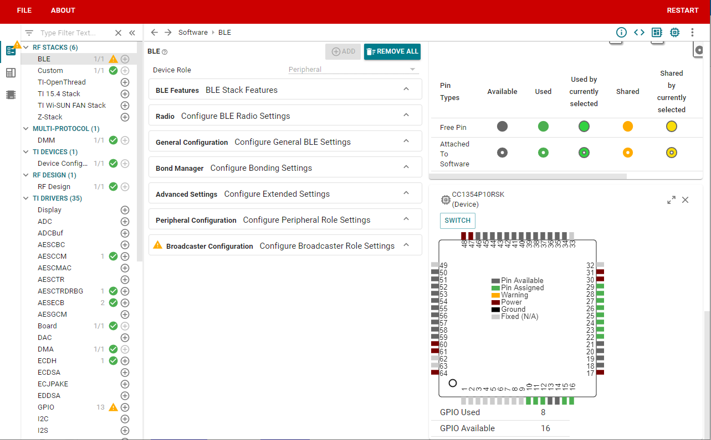
</div>

6. Select "Board" as "None" and "Device" as "CC2674P10RGZ", Unselect "Lock PinMux", and click "Confirm".

<div style="text-align: center;">
  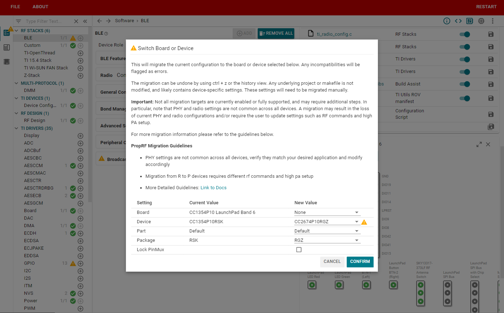
</div>

To clear the errors, make the following changes:

1. Clear the error in RF Design by clicking on 'accepting the current value', which should be 'LP_CC2674R10_RGZ' in the drop down menu for 'Based On RF Design'

<div style="text-align: center;">
  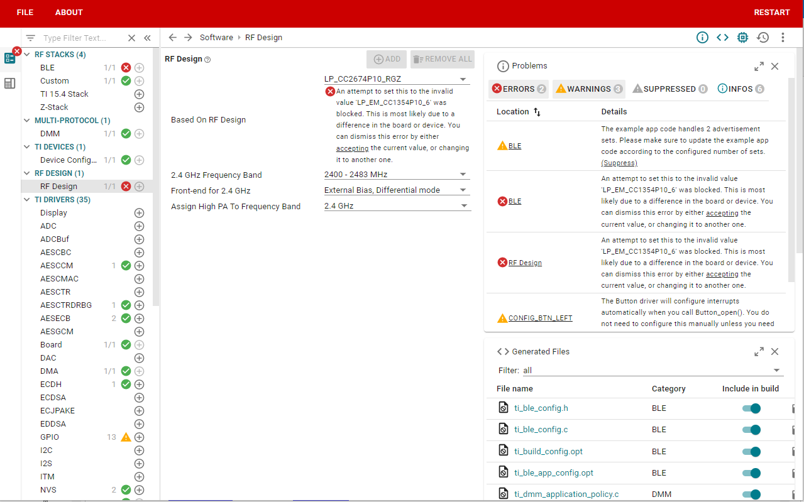
</div>

2. Clear Global Event Mask in TI Drivers > RF by clicking on the cross and leaving the field blank

<div style="text-align: center;">
  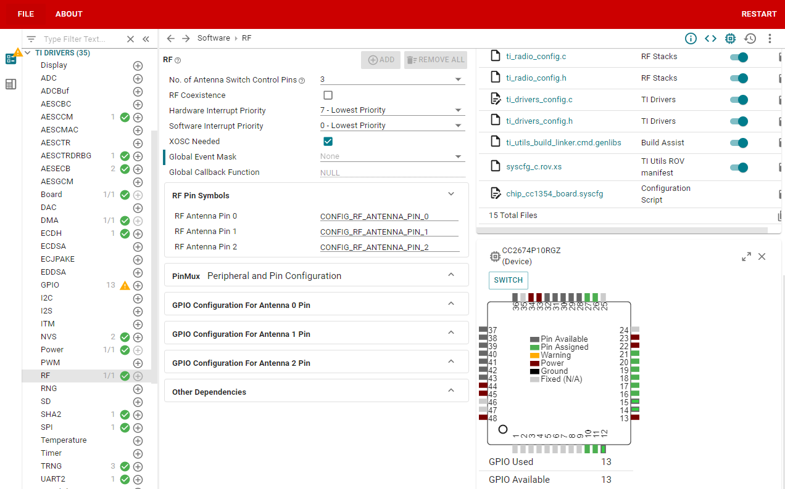
</div>

> Also, set the number of antenna switch control pins to 0. 

<div style="text-align: center;">
  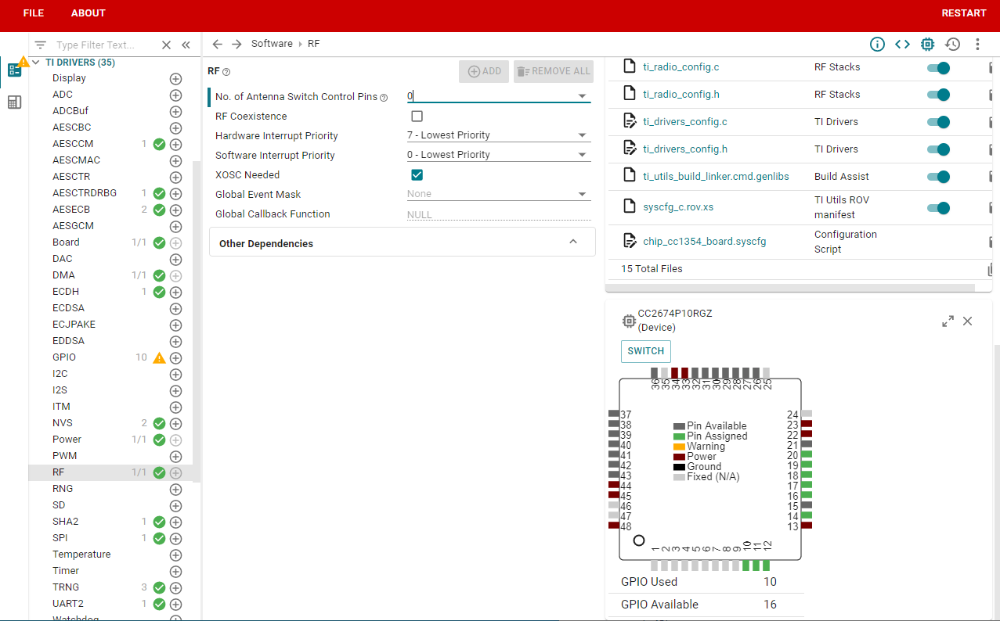
</div>

3. Clear the current GPIO settings in Ti Drivers > GPIO and press remove all.

<div style="text-align: center;">
  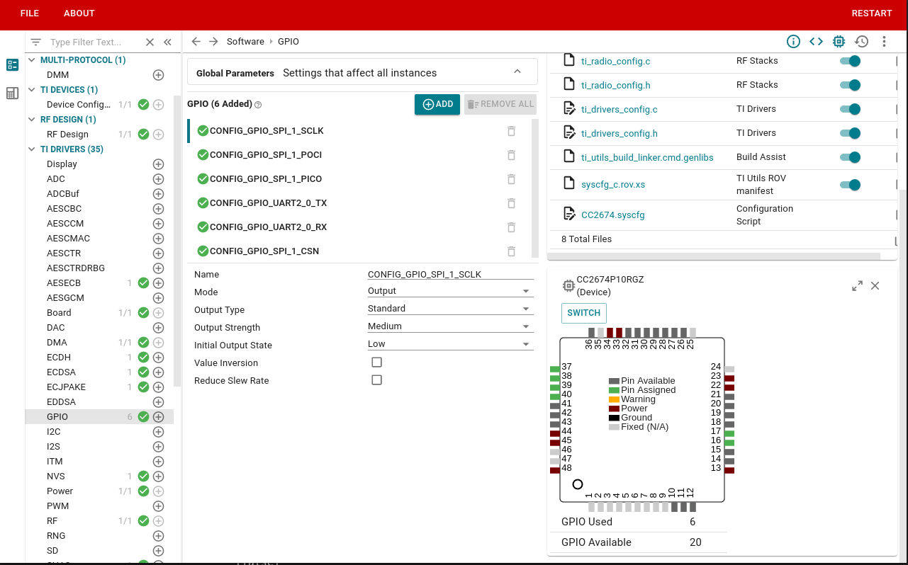
</div>

> Add Spinel interrupt pin. Name it CONFIG_SPINEL_INT and give the values shown:

<div style="text-align: center;">
  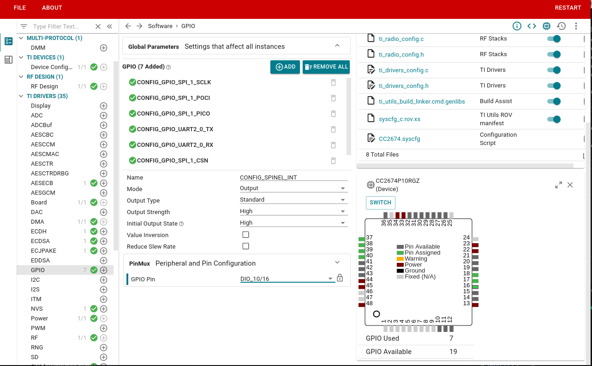
</div>

4. Reconfigure the GPIOs:
    - UART2:  Configure TI Drivers > UART2 > PinMux as follows (UART Peripheral = UART0, TX Pin = DIO_13/19, RX Pin = DIO_12/18)

    <div style="text-align: center;">
    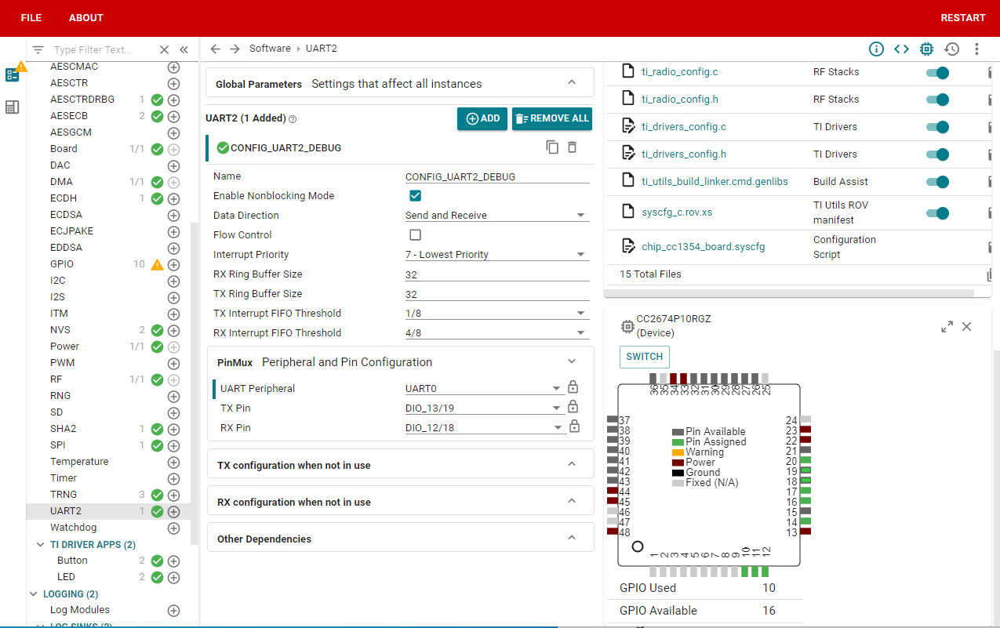
    </div>
    
    - Buttons: Configure the GPIO for the buttons. Under TI DRIVER APPS > Button, select CONFIG_BTN_LEFT and under Pin Mux, select Button as DIO_15. Then select CONFIG_BTN_RIGHT and under Pin Mux, select Button as DIO_14

    <div style="text-align: center;">
    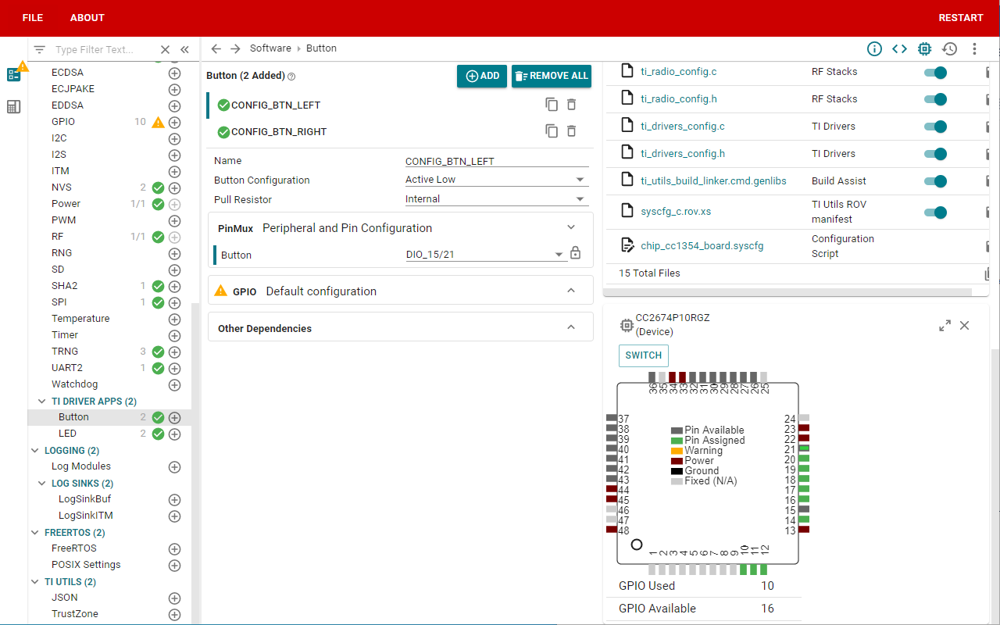
    </div>

    <div style="text-align: center;">
    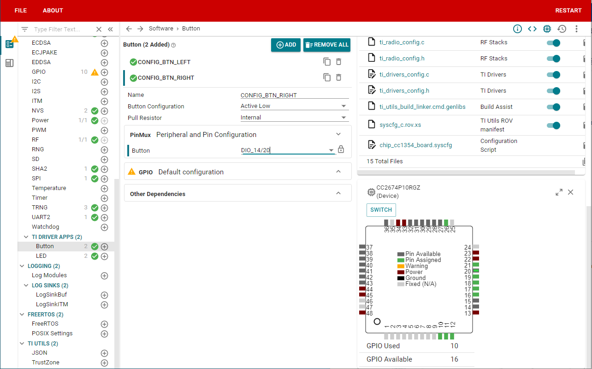
    </div>
    
    - LEDS: Configure the GPIO for the LEDs. Under TI DRIVER APPS > LED, select CONFIG_LED_RED and under Pin Mux, select LED Pin as DIO_6. Then select CONFIG_LED_RIGHT and under Pin Mux, select LED Pin as DIO_7

    <div style="text-align: center;">
    
    </div>

    <div style="text-align: center;">
    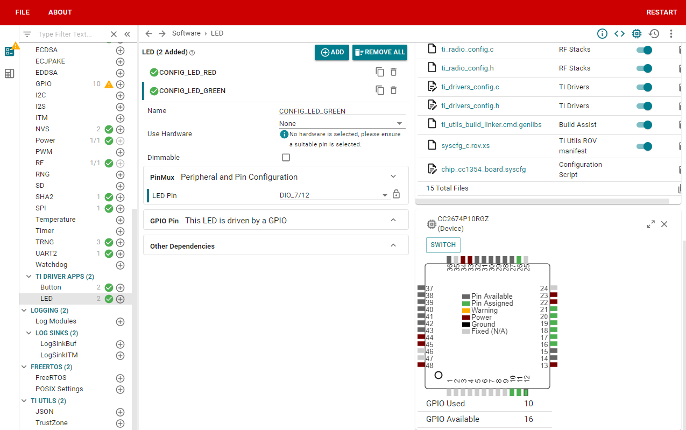
    </div>

5. Finally, Uncheck XOSC Cap Array modification
    
<div style="text-align: center;">
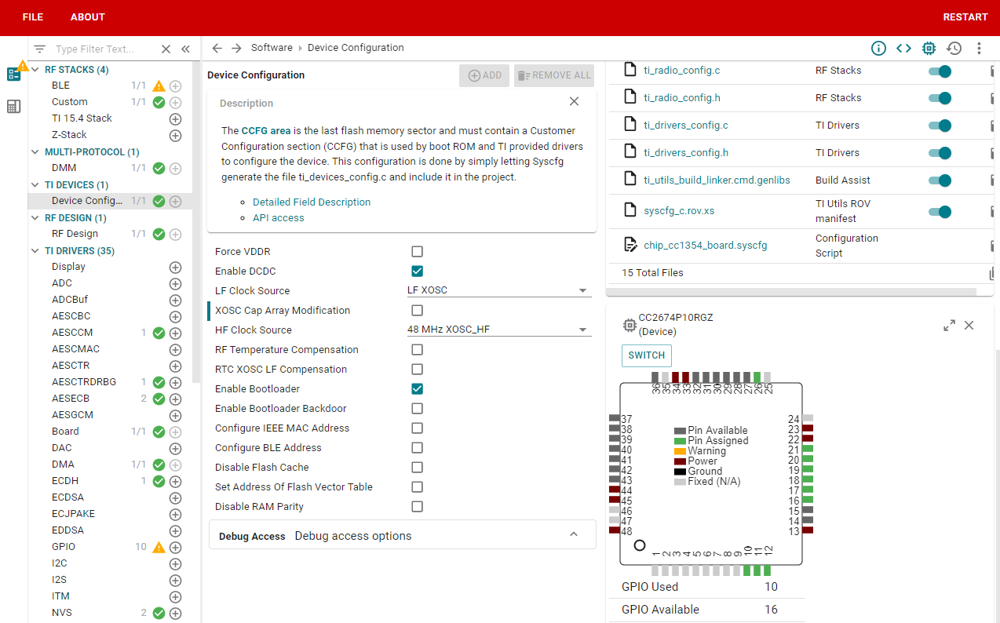
</div>

## Modifications required for the CC2674R10

After applying all items in the `Modification required for the CC2674P10 device` section in the `SysConfig GUI`
section, the subsequent changes apply specifically for the CC2674R10 and
should be addressed from a SysConfig Editor.

1. Pins will need to be reconfigured as such:

    | SysConfig pin name | R10 `PinMux` |
    | ------------------ | ------------ |
    | UART_RX            | `DIO_2`      |
    | UART_TX            | `DIO_3`      |
    | CONFIG_BTN_LEFT    | `DIO_13`     |
    | CONFIG_BTN_RIGHT   | `DIO_14`     |
    | CONFIG_LED_RED     | `DIO_6`      |
    | CONFIG_LED_GREEN   | `DIO_7`      |

2. _Custom -> IEEE 802.15.4-2006, `250 kbps`, `OQPSK`, `DSSS = 1:8` -> Code
   Export Configuration_, acknowledge and dismiss the PA radio setup error
3. _Custom -> IEEE 802.15.4-2006, `250 kbps`, `OQPSK`, `DSSS = 1:8` -> RF
   Command Symbols_, change `CMD_RADIO_SETUP` from `RF_cmdRadioSetup` to
   `RF_cmdIeeeRadioSetup` and add the following functions from the drop-down:
   - a CMD_TX_TEST
   - b. CMD_IEEE_ED_SCAN
   - c. CMD_IEEE_CSMA
   - d. CMD_IEEE_RX_ACK  

After this, the example's `README.md` instructions can be followed to produce
the executable needed.