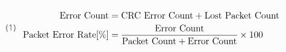

# Application Development

The [SimpleLink CC13xx/CC26xx](https://www.ti.com/tool/download/SIMPLELINK-LOWPOWER-F2-SDK) SDK for TI-OpenThread is intended to be developed with one of the following development boards:

- [CC1352R LaunchPad](https://www.ti.com/tool/LAUNCHXL-CC1352R1)
- [CC1352P-2 LaunchPad](https://www.ti.com/tool/LAUNCHXL-CC1352P)
- [CC26x2R LaunchPad](https://www.ti.com/tool/LAUNCHXL-CC26X2R1)
- [CC2652R7 LaunchPad](https://www.ti.com/tool/LP-CC2652R7)
- [CC2674x10 LaunchPad](https://www.ti.com/product/CC2674P10)
- [CC1354x10 LaunchPad](https://www.ti.com/tool/LP-EM-CC1354P10)


The SDK provides the source code of the OpenThread stack, found in the `source/third_party/openthread/` folder under the SDK installation directory. The SDK does not provide any pre-compiled libraries for OpenThread.

## OpenThread API Mutex
As described in Application Architecture, an API mutex is employed by TI-OpenThread when accessing the OpenThread API. This was to ensure coherent access to the OpenThread APIs by both the user application tasks and the OpenThread stack task.

The API mutex is available in the `OtRtosApi` module, found under the `otsupport/` folder in the example project. The `OtRtosApi` module is initialized by the OpenThread stack task.

For expansions of the Openthread project to use multiple tasks that access the Openthread Stack, users must implement `OtInstance_get()` to return a copy of `otinstance` if Openthread stack access is required in a separate task context. Being sure to first initialize the openthread stack semaphore via `OtRtosApi_init()`, calls should then be wrapped by `OtRtosApi_lock()` and `OtRtosApi_unlock()` API's.

The underlying implementation of the API mutex uses `pthread_mutex_t`. For more information, see TI-POSIX User’s Guide.

Usage of the `OtRtosApi` module is straightforward: any task that wants to access the OpenThread API must first lock the mutex, access one or more OpenThread APIs, and finally unlock the mutex.

```c
#include <otsupport/otrtosapi.h>

void foo(void)
{
    OtRtosApi_lock();
    /* Access one or more OpenThread APIs */
    OtRtosApi_unlock();
}
```

> **__Warning__** Be aware that if a task fails to unlock the API mutex after locking it, any other tasks trying to access the API mutex will result in a deadlock. In other words, tasks trying to lock the API mutex will never return.

## Low-Power Operation

Thread provides support for low-power devices by defining a device type called Sleepy End Device (SED). A SED is a MTD which has the ability to disable the transceiver when idle, which allows for battery-constrained devices to operate in a Thread network.

By default in OpenThread, a MTD is configured as a MED. In order to configure a MTD to be a SED the rx-on-when-idle value in the Thread device mode must be unset. Additionally, the data poll period can be configured, but is not required.

> **__NOTE:__** 
> Changing to low power operation is supported through the CLI.
> * To change to SED the command is "mode -". To change the poll period use the command "pollperiod (period in ms)".
> * To change to SSED use the command "mode -" and change the CSL period with the command "csl period (period)"
> * When using csl period units to get the correct value take the period in ms and multiple by 6.25. EX: 500ms -> 500 x 6.25 = 3125. this is the value you would put in the csl period command for 500 ms.

The Thread device mode is configured in OpenThread as follows:

*Listing 19. Sleepy End Device configuration in OpenThread.*
```c
#include <openthread/error.h>
#include <openthread/instance.h>
#include <openthread/link.h>
#include <openthread/thread.h>

void configureSleepyEndDevice(otInstance *aInstance, uint32_t aPollPeriod)
{
    otLinkModeConfig linkMode;
    otError error;

    /* Set Thread device mode for SED */
    linkMode.mRxOnWhenIdle       = 0;  /* Must be set to 0 for SED */
    linkMode.mSecureDataRequests = 1;  /* Must be set to 1 */
    linkMode.mDeviceType         = 0;  /* Must be set to 0 for MTD */
    linkMode.mNetworkData        = 1;  /* Can be either 0 or 1 */

    /* Update Thread device mode and data poll period.
     * Any appropriate error checking should be done.
     */
    error = otThreadSetLinkMode(aInstance, linkMode);
    otLinkSetPollPeriod(aInstance, aPollPeriod);
}
```

## FCC Testing Functionality

FCC and other similar RF regulatory bodies often require certain certifications to be fulfilled before a product is brought to market, even though the Thread protocol makes no such requirements. Therefore, it is desirable to have FCC testing functionality available in a Thread example project.

The diag (diagnostic) module in OpenThread provides a set of commands to manipulate the radio from within the OpenThread environment. The diag module is accessible from the OpenThread CLI application.

Mainly two FCC testing functionalities are supported: PER test functionality with SmartRF Studio compatibility, and test of continuous tone. The result of a PER test is calculated in the same fashion as SmartRF Studio, shown in equation (1).


<div style="text-align: center;">
  
</div>

### Test of Continuous Transmission

The API for starting and stopping a continuous transmission is on the following format:

```
diag transmit start <packet size> <interframe space> <transmit count>
diag transmit stop
```

Packet size specifies the payload of the packet in bytes, the interframe space specifies time between each packet in milliseconds, and transmit count specifies the number of packets to send.

> **__Note__** If you want to receive and observe the transmitted packets, you can use an IEEE 802.15.4-capable LaunchPad with [SmartRF Studio](https://www.ti.com/tool/SMARTRFTM-STUDIO), configuring the device to the same channel in Packet RX mode expecting infinite packets. This is optional.

To start a test of continuous transmission with your Thread device, do the following:

1. Build and flash the cli_ftd example application.
2. Input the following commands in the UART CLI.

```
diag start
diag channel 12
diag power 5
diag transmit start 100 30 500
```

3. (Optional) Observe the packets in [SmartRF Studio](https://www.ti.com/tool/SMARTRFTM-STUDIO).
4. Stop the transmission with the commands in the UART CLI.

After stopping the transmission, a test report is displayed with statistics over how many packets were transmitted.

For channels near the band edge (such as channel 25 and 26), it may be necessary to lower the maximum output power to pass FCC certification tests. As this is dependent on the hardware design, refer to the following code to set the appropriate power limit for your design.

```c
/**
 * Array of back-off values necessary for passing FCC testing.
 */
static const struct tx_power_max cTxMaxPower[] =
{
    { .channel = 26, .maxPower = 15 }, /* back-off for 25 deg C, 3.3V */
    { .channel = 25, .maxPower = 19 }, /* back-off for 25 deg C, 3.3V */
};
```

### Test of Continuous Reception

The API for starting and stopping a continuous transmission is one the following format:
```
diag receive start
diag receive stop
```
No additional parameters are required. Stopping the continuous reception will present a PER report of packets received.

> **__Note__** It is required to have a device sending out a continuous transmission on the same channel, while the continuous reception test is running to have any meaningful results. Either setup SmartRF Studio with an IEEE 802.15.4-capable LaunchPad in Packet TX mode on the same channel sending infinite packets, or see Test of Continuous Transmission.

To start a test of continuous reception with your Thread device, do the following:

1. Build and flash the cli_ftd example application.

2. Input the following commands in the UART CLI.

```
diag start
diag channel 12
diag receive start
```

3. Start packet transmissions from your other device.

4. When satisfied, stop packet transmissions.

5. Stop the transmission with the commands in the UART CLI, observing the report.

```
diag receive stop
diag stop
```

After stopping the reception, a test report is displayed with statistics over received packets, including [PER]().

### Test of Continuous Tone

The API for starting and stopping a continuous tone is one the following format:

```
diag tone start
diag tone stop
```

No additional parameters are required. To observe the continuous tone, setup a Spectrum Analyzer near the DUT; or, setup [SmartRF Studio](https://www.ti.com/tool/SMARTRFTM-STUDIO) in Continuous RX mode on the same channel.

To start a test of continuous tone with your Thread device, do the following:

1. Build and flash the cli_ftd example application.

2. Input the following commands in the UART CLI.

```
diag start
diag channel 12
diag power 5
diag tone start
```

3. Observe the transmission over the air with the Spectrum Analizer or [SmartRF Studio](https://www.ti.com/tool/SMARTRFTM-STUDIO).

4. Stop the transmission with the commands in the UART CLI, observing the report.

```
diag tone stop
diag stop
```

No test report is displayed after stopping the tone.