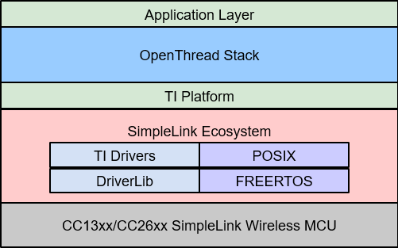
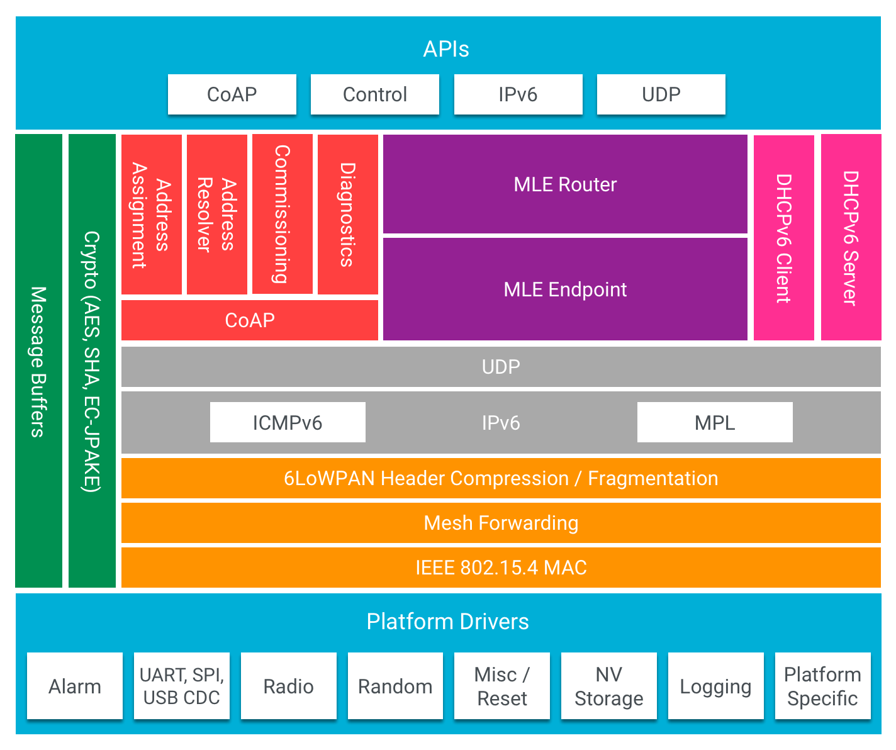
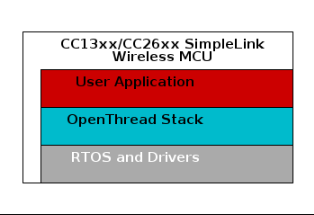
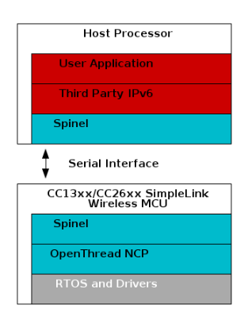

# TI-OpenThread Overview
This section describes the architecture of a TI-OpenThread application at a high level and the architecture of the OpenThread stack itself. Also, the different system configurations which are supported by TI-OpenThread are described.

## Application Architecture

A TI-OpenThread application executes in a single RTOS task. Figure 20. provides an architectural overview of a generic TI-OpenThread application.

  
  
 Figure 20. Architecture overview of a TI-OpenThread application.

The OpenThread stack instantiates an OpenThread stack instance and does basic setup of the stack primitives. The OpenThread stack manages a queue of tasks to be run called tasklets. The primary objective of the stack task is to process these queued tasklets. The stack task also processes the TI-OpenThread platform-specific drivers, which is the adaptation layer between the OpenThread stack and [TI Drivers API Reference](https://dev.ti.com/tirex/explore/node?node=A__AD0ghBnDPMQSci35.HFlFA__com.ti.SIMPLELINK_CC13XX_CC26XX_SDK__BSEc4rl__LATEST).

The OpenThread stack is designed and developed for a single-threaded environment; this was done so by the OpenThread developers for the sake of simplicity and ease of testing. Therefore, the OpenThread stack assumes there is implicit mutually exclusive access to its data structures. In case a multi-task application uses Thread, a recursive mutex must be put in place in order to ensure coherent access to the OpenThread APIs by both the user application task(s) and the OpenThread stack task.

## OpenThread Stack Architecture

The OpenThread stack is an open-source implementation of the Thread specification, and is implemented in C++ with C-bindings for the OpenThread API. The implementation is written in portable C++03 and C99. OpenThread is a platform-agnostic stack, and makes no assumptions on the underlying platform. That means OpenThread can run in both bare-metal environments and on fully fledged OSes.

The OpenThread stack is designed and developed for a single-threaded environment; this was done so by the OpenThread developers for the sake of simplicity and ease of testing. Therefore, the OpenThread stack assumes there is implicit mutually exclusive access to its data structures. In case a multi-task application uses Thread, a recursive mutex must be put in place in order to ensure coherent access to the OpenThread APIs by both the user application task(s) and the OpenThread stack task.

The stack dispatches work into lightweight tasks called tasklets, which are segments of code written in a non-blocking fashion. The stack manages a queue of pending tasklets to be run, which are processed by the underlying stack task context.

Please refer to the [OpenThread Platforms](https://openthread.io/platforms) section for more information about the OpenThread platform in general, or refer to the [OpenThread GitHub](https://github.com/openthread) for the full source code.

<figure align = center>

<figcaption>Figure 21. OpenThread stack architecture. Source: https://openthread.io/platforms
</figure>

## Platform Configurations
TI-OpenThread supports both system-on-chip ([SoC](https://dev.ti.com/tirex/explore/content/simplelink_cc13xx_cc26xx_sdk_7_10_02_23/docs/thread/html/thread/glossary.html#term-SoC)) and network co-processor ([NCP](https://dev.ti.com/tirex/explore/content/simplelink_cc13xx_cc26xx_sdk_7_10_02_23/docs/thread/html/thread/glossary.html#term-NCP)) architectural configurations.

TI-OpenThread supports both single-chip ([CLI](https://github.com/TexasInstruments/ot-ti/tree/release/thread-1.3-certification-support/examples/apps/cli)) and dual-chip (Network Co-Processor ([NCP](https://github.com/TexasInstruments/ot-ti/tree/release/thread-1.3-certification-support/examples/apps/ncp)) and Radio Co-Processor ([RCP](https://github.com/TexasInstruments/ot-ti/tree/release/thread-1.3-certification-support/examples/apps/rcp))) architectural configurations.

## Single-Chip, Thread-Only (SoC)
Both the application and the OpenThread stack run on the device as a true single-chip solution. This configuration is the most cost-effective solution and provides the best low-power performance, and is therefore most commonly used for end devices. Devices with sufficient Flash and RAM should be used.

<figure align = center>

</figure>

## Network Co-Processor (NCP)
The OpenThread stack runs on the device while the application is executed on a separate external host processor. The host processor communicates with the NCP device via a serial interface, such as UART or SPI, over the [Spinel Protocol](https://datatracker.ietf.org/doc/html/draft-rquattle-spinel-unified-00).

The NCP configuration is useful for applications that must add wireless connectivity or peripheral applications, which execute on a host processor without the requirement to implement the complexities associated with a wireless networking protocol. In these cases, the application can be developed externally on a host processor while running Thread on the NCP device, which provides ease of development and quickly adds Thread support and wireless connectivity to existing products.

## Radio Co-Processor (RCP)
The OpenThread radio runs on the device while the application and stack are executed on a separate external host processor. The host processor communicates with the RCP device via a serial interface, such as UART or SPI, over the [Spinel Protocol](https://datatracker.ietf.org/doc/html/draft-rquattle-spinel-unified-00).

The RCP configuration is useful for Thread applications that execute on a host processor without the radio implementation. In these cases, the application and Thread stack can be developed and configured externally on a host processor while running Thread radio commands on the RCP device, which provides simple completion of the system.

For more information, refer to [NCP Interface](/ti-openthread-ncp-interface.md).

<figure align = center>

</figure>
