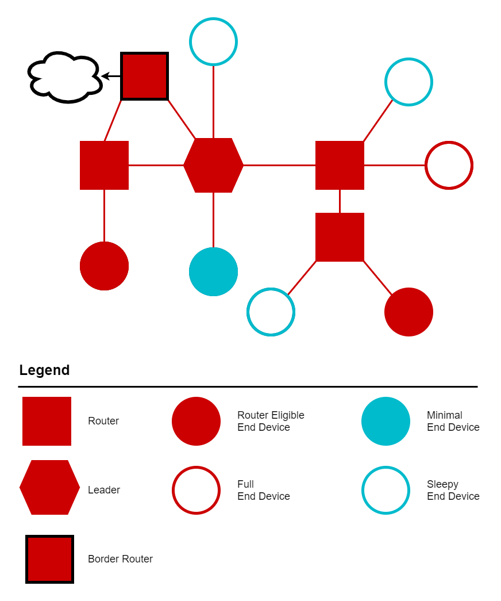
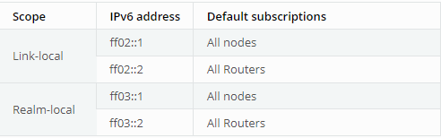
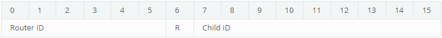
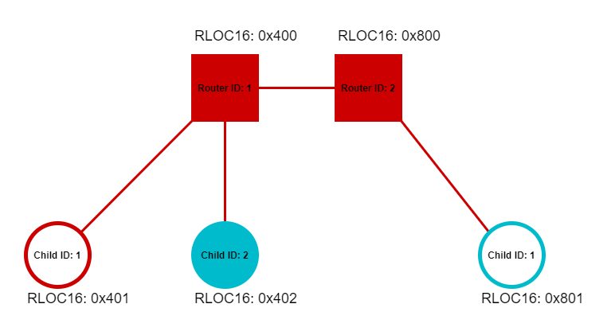
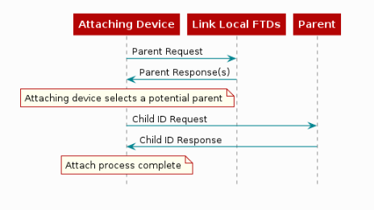
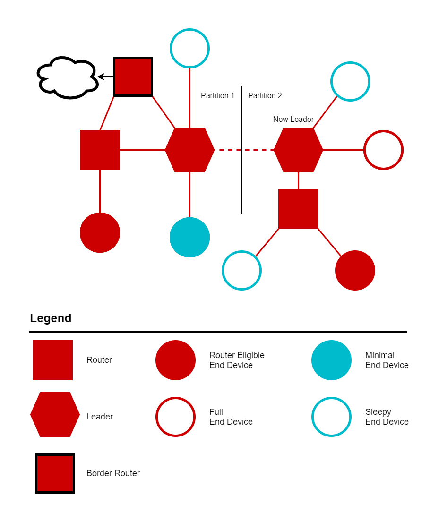

# Thread Networking Protocol

This chapter gives a brief overview of the Thread networking protocol. As mentioned in TI-OpenThread Introduction, Thread is an IP-based, mesh networking protocol that runs on 802.15.4 radios, with the goal of providing the best way to connect and control products in the home. Some notable benefits of Thread are briefly discussed below.

Thread natively supports IPv6 (via 6LoWPAN). This allows Thread devices to communicate with other IP-based devices and make use of other industry-proven IP-based standards.

Thread is a distributed protocol, so there is no single point of failure. Routes within the network are repaired as needed, and the number of routing devices dynamically changes to optimize network traffic.

Thread uses the 802.15.4 specification for its MAC and PHY layers, which is a favorable choice for home and building automation types of applications. This provides a strong base for low-power wireless networks.

## Thread Devices

This section explains the different Thread devices and their roles within a Thread network.

In the following sections we will explain:
- the roles a device can take on
- the two different device types
- what modes each device type uses to fill a role

### Device Roles

Thread devices can take on different roles within a Thread Network; End Device, Router, Router-Eligible End Device, Leader, or Border Router. All devices start as End Devices and are promoted from there as the network requires.

**End Devices** connect to a single Router. All traffic to and from the End Device goes through its parent Router. If the End Device loses the connection to its parent Router, it will attempt to find a new parent Router.

**Routers** connect to other Routers and act as parents to End Devices. These devices transmit, receive, and forward messages around the mesh network. Routers may be parents to multiple End Devices (up to 511), and act as proxies for their children when doing networking activities like responding to address queries. Routers maintain their next hop and cost to all other Routers in the network. Routers maintain a persistent copy of the active network information (known as the Active Operational Dataset) received from the Leader. Their other maintenance related duties are discussed in Network Maintenance section.

**REEDs**, or Router-Eligible End Devices, are End Devices with Router capabilities. They do not route messages; just like End Devices, they primarily send/receive traffic from their parent. As the name suggests, REEDs are eligible to become Routers and perform some Router-like tasks, which are discussed in Network Maintenance section.

The **Leader** of a Thread Network is a Router that has been elected to make decisions for the Thread Network. These decisions are choices like: the current active commissioner, Router upgrading, and more. The Leader is elected by being the first Router within a partition.

**Border Routers** are Routers on the Thread Network with an off-mesh route. Border Routers act as the bridge between the Thread IPv6 network and an adjacent IPv6 network like WiFi or Ethernet networks. Border Routers offer globally routable IPv6 prefixes configurable with SLAAC or DHCPv6.

### Device Types

A Thread device can be either a Full Thread Device (FTD) or a Minimal Thread Device (MTD).

An FTD has its receiver always on and can act as an End Device, a Router, a Leader, or a Border Router. There are two types of FTD End Devices: Full End Devices (FED) and Router-Eligible End Devices (REED). An FED will remain an End Device while a REED could change to a Router. As mentioned previously, all devices initially attach as End Devices. Throughout the lifetime of the network, conditions may require that more or fewer Routers are needed. To accommodate this, a REED may change to a Router, or a Router may change to a REED. Although an End Device receives all unicast messages from its parent, an FED may additionally receive multicast messages from neighboring Routers.

An MTD is limited to only End Device roles: Minimal End Device (MED) or Sleepy End Device (SED). An MED will have its receiver always on (thus not required to poll its parent for messages), while an SED will have its receiver on only when it expects to receive messages (e.g. after polling its parent).

Below shows an example of a Thread network.

  
  
Figure 35. Example Thread Network

### Device Modes

For a Thread device in a network, its device type and role can be associated with which bits are set in its mode byte. Currently there are 4 bits which may be set, R, S, D, and N, 
described below.

| R         | RX on while idle    | Set this value to have the receiver always on. Clearing this enables the radio to sleep.    |
|--------------|-----------|------------|
| S         | Secure IEEE 802.15.4 data requests     | Set this value to enable encryption on data requests to the parent router. Clearing this may introduce a weak link in the network. Data requests are only sent when the radio can sleep. |
| D | Full Function Device     | Indication that this device should act as an 802.15.4 FFD. This is required for FTDs.        |
| N      | Full Network Data | Set this to indicate that this device should receive all network data, stable and unstable.       |

Device modes are tied to how that device will behave once it is attached to a Thread Network. When an FTD attaches to a Thread Network it will attach as a Full End Device (FED) or a Router-Eligible End Device (REED). If the FTD attaches as a REED, the Thread network will make the decision to promote that device to an Active Router role if network topology or routing requires. When an MTD attaches to a Thread Network, it will attach as either a Minimal End Device (MED) or a Sleepy End Device (SED). If an MTD attaches as a SED, the parent Router is required to buffer messages for the SED until it wakes up and polls.

  

## Addressing

Each Thread device is associated with a set of IPv6 addresses, providing multiple ways of addressing a device for different purposes.

There are two “properties” of a given address: scope and type.

Address **scope** is link-local or realm-local. Link-local scope consists of addresses of devices which can be reached within a single radio transmission. Realm-local (or mesh-local) scope consists of addresses of devices within the same network partition.

Address **type** is unicast or multicast. A unicast address is used to send to a single device, and a multicast address is used to send to a designated group of devices who have subscribed to said multicast address.

The scope and type of an address can be determined by the address itself. A link-local address will have the first two bytes as **fe80** (i.e. it has a prefix of **fe80::/16**), and a mesh-local address will have the first byte as **fd** (i.e. it has a prefix of **fd00::/8**). There are four default multicast addresses, which are described in the table below.

  

(A helpful reference for understanding notation of IPv6 addresses may be found in RFC4291).

Mesh-local addresses are those which are reachable within the same Thread network. As such, these are the addresses which Thread applications should use when sending messages to each other. Other address types are used mainly for management and administrative purposes, such as neighbor discovery.

One common unicast address used is the Routing Locator (RLOC). This is an IPv6 unicast address identifying the location of a device within the network. It is composed of the mesh-local prefix and an Interface Identifier (IID) which includes the RLOC16 (e.g. [64-bit mesh-local prefix] + 0000:00FF:FE00:**RLOC16**). The RLOC16 encodes a Router ID and a Child ID. Each Router is assigned a unique Router ID (with Child ID of 0); each End Device is assigned its parent’s Router ID and a unique Child ID (non-zero). Note that the application does not explicitly use RLOC16; it will use some mesh-local EID, and the network layer will map this to an RLOC16 (based on an EID-to-RLOC cache it maintains). When these addresses are assigned are described in Attaching. Below shows an example of RLOC16, and in a network.

  

  
  
Figure 36. RLOC16 in a Network

## Network Setup
A Thread device may either join or form a new network (based on its configurations). In either case, it scans each channel for existing networks. Afterwards, it may attempt to join a network it recognizes (e.g. extended PAN ID, network name) or form a new one.

Forming a network, a device must set values for various parameters:

- PAN ID
- Extended PAN ID
- Network Name
- Mesh-local Prefix
- Master key
- Commissioning credential
- PAN ID and extended PAN ID should be unique on a given channel (as required by 802.15.4).

Joining a network consists of commissioning and attaching.

### Commissioning
Commissioning is the process where a new untrusted device is authenticated and securely brought onto the Thread Network. Commissioning can be split into two major categories, external commissioning and native commissioning. External commissioning would be the case if the commissioner resides off-mesh of the Thread Network (perhaps on a different technology, like BLE or Wi-Fi). External commissioning requires a border agent to relay communication to and from the off-mesh commissioner. Native commissioning only requires on-mesh nodes. To evaluate commissioning on TI devices, you can refer to this SimpleLink Academy: [Thread CLI Project Zero](https://dev.ti.com/tirex/explore/node?node=AHJj4J1TlqSDsf7FG8IbNg__pTTHBmu__LATEST). Consult chapter 8 of the Thread 1.3 specification for a better overview of the commissioning protocol.

### Attaching
If the commissioning process is successful, then the device begins the attach process. First, it will search for a parent by multicasting (ff02::2) a Parent Request. Link-local routers which receive this Parent Request reply with a Parent Response. The joining device then selects a suitable parent, sending it a Child ID Request. The parent sends a Child ID Response, completing the attach process. The joining device is now part of the network, with a parent and a routable address (RLOC). Below shows a diagram illustrating the attach process.

  
  
Figure 37. Device Attaching to Thread Network

## Network Maintenance
In order to maintain a reliable network, Routers/REEDs perform maintenance duties throughout their lifetime. Some of the key duties are discussed below.

### Advertisements
In order to maintain delivery reliability within the network, each Router multicasts (to ff02::1) advertisements periodically. REEDs send advertisements periodically. When a Router/REED multicasts an advertisement, it is informing link-local Routers/REEDs about its path to all Routers in the network.

Routers use information from advertisements, such as incoming/outgoing quality and routing cost, to optimize routing reliability. For example, a Router may discover that there is a more efficient route to a destination, and update its routing tables. This algorithm is to ensure that each Router has knowledge of all other reachable Routers in the network, and consequently has the optimal path to all of them. This also well informs REEDs, should they upgrade to Routers.

### Dynamic Routers
The number of Routers (up to 32) in a network may change under certain conditions. A REED may convert to a router to accommodate for more End Devices or to maintain a path between all Routers. A Router may become a REED if there is sufficient redundancy of paths within the network. Router upgrading and downgrading is a decision which must be approved by the Leader (who manages Router IDs). Advertisements ensure that each Router/REED in the network is aware of any changes in the set of Routers.

### Partitions
One goal of a Thread network is to keep connectivity between all devices. However, a Thread Router/REED might find itself disconnected from the Leader. This can be due to a number of factors, for example the Leader losing power. But once this loss of connectivity is detected, the Router/REED will search for a partition to join, and if none is found, form a new partition with itself as the Leader. If a Router/REED detects that a higher-priority partition is in range (via advertisements), it will attempt to attach to that partition. (Rules to derive partition priority are defined in 5.16.3 of the Thread 1.3 specification). Upon moving to a network partition, devices must check that its IP addresses are consistent with that partition (e.g. Mesh-local prefix may have changed). The set of all partitions is still considered to be in one Thread network, since they share the same network credentials. The Thread network may consist of multiple, independently operational partitions. These partitions will tend to converge to as few partitions as possible.

  
  
Figure 38. Network Partitions

## Thread Applications
Thread offers IP connectivity and low power operation through its transport and network layers, making it a strong foundation for applications relying on these two pillars. Thread is application-independent, allowing endless possibilities for the application layer. 