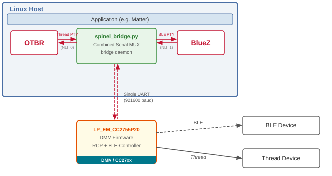
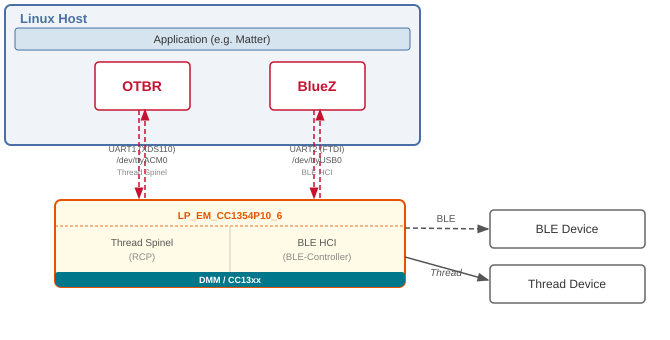

# OpenThread RCP-BLE-Controller Example

## Introduction

This example demonstrates running both the Thread (RCP) and BLE Controller stacks
simultaneously on a single TI device connected to a Linux host.

Following this guide you will be able to:

- Create a Thread network via OTBR + RCP-BLE-Controller setup
- Join a node to the Thread network
- Send messages between two Thread network devices
- Scan for active BLE peripheral devices via BlueZ + RCP-BLE-Controller setup
- Connect to a BLE peripheral device

## Architecture

### cc23xx/cc27xx — Combined Serial MUX (Single UART)

On cc27xx devices, both Thread Spinel and BLE HCI traffic are multiplexed over a
**single UART port** using HDLC framing and Spinel NLI routing.
The `spinel_bridge.py` daemon on the host demultiplexes the single UART into
per-stack virtual PTYs — one for `otbr-agent` and one for BlueZ (`hciattach`).
No FTDI cable is required.

<div style="text-align: center;">
  
  <div class="caption">Figure 1. cc23xx/cc27xx — Combined Serial MUX Setup</div>
</div>

### cc13xx/cc26xx — Dual-UART (Legacy)

On cc13xx devices, Thread and BLE traffic use separate UARTs:

- **UART1 — XDS110** (e.g. `/dev/ttyACM0`) → Thread Spinel → `otbr-agent`
- **UART2 — FTDI cable** (e.g. `/dev/ttyUSB0`) → BLE HCI → BlueZ `hciattach`

<div style="text-align: center;">
  
  <div class="caption">Figure 2. cc13xx/cc26xx — Dual-UART Setup</div>
</div>

## Wire Protocol (cc23xx/cc27xx)
    
The Combined Serial MUX encapsulates each protocol in an HDLC frame with a
Spinel NLI header:

```
[0x7E] [Spinel header (NLI)] [payload] [CRC16] [0x7E]

NLI 0 = Thread Spinel frames  → otbr-agent
NLI 1 = BLE HCI packets       → BlueZ / hciattach
NLI 3 = Keepalive heartbeat   → bridge internal
```

## Software Prerequisites

- [OpenThread Border Router (ot-br-posix)](https://github.com/openthread/ot-br-posix)
- [UniFlash](https://www.ti.com/tool/UNIFLASH)
- x86-based Linux environment for application builds
- [BlueZ](https://github.com/project-chip/connectedhomeip/blob/master/docs/guides/BUILDING.md)
  (`bluez` package — includes `hciconfig` and `hciattach`)
- Python 3.7+ with `pyserial` (for `spinel_bridge.py` on cc27xx hosts)

## Hardware Prerequisites

### RCP-BLE-Controller Device

**cc23xx/cc27xx (Combined Serial MUX — recommended):**

- [LP_EM_CC2755P20](https://www.ti.com/tool/LP-EM-CC2755P20)
- [LP_EM_CC2755P10](https://www.ti.com/tool/LP-EM-CC2755P10)
- LP_EM_CC2755R10_BG
- [LP_EM_CC2745R10_Q1](https://www.ti.com/tool/LP-EM-CC2745R10-Q1)

**cc13xx/cc26xx (Dual-UART legacy):**

- [LP_EM_CC1354P10_6](https://www.ti.com/tool/LP-EM-CC1354P10)
- [LP_EM_CC1354P10_1](https://www.ti.com/tool/LP-EM-CC1354P10)
- LP_CC2653P10
- CC2674P10RGZ

### Linux Host (Border Router / BLE Host)

This example has been verified on:

- Generic Linux Ubuntu 22.04 host
- [Raspberry Pi 4](https://www.raspberrypi.com/)
- [BeagleBone Black](https://www.beagleboard.org/boards/beaglebone-black)
  (Debian 10 Buster, offline — see [host/README_BBB_HOST.md](host/README_BBB_HOST.md))

Note: Host must have a Linux image with native BlueZ and HCI support.

**cc13xx only:** A UART FTDI cable is also required for the BLE HCI UART.

### Secondary Thread Device (FTD/MTD — for Thread network testing)

Any of the following boards running the `cli-ftd` or `cli-mtd` example:

- [SimpleLink CC1352P2 Launchpad](https://www.ti.com/tool/LAUNCHXL-CC1352P)
- [SimpleLink CC1352P4 Launchpad](https://www.ti.com/tool/LAUNCHXL-CC1352P)
- [SimpleLink CC1352P7 Launchpad](https://www.ti.com/tool/LP-CC1352P7)
- [SimpleLink CC1352P7-4 Launchpad](https://www.ti.com/tool/LP-CC1352P7)
- [SimpleLink CC1354P10-1 Launchpads](https://www.ti.com/tool/LP-EM-CC1354P10)
- [SimpleLink CC26X2R1 Laundpads](https://www.ti.com/tool/LAUNCHXL-CC26X2R1)
- [SimpleLink CC2652PSIP Launchpad](https://www.ti.com/tool/LP-CC2652RSIP)
- [SimpleLink CC2652R7 Launchpad](https://www.ti.com/tool/LP-CC2652R7)
- [SimpleLink CC2652RB Launchpad](https://www.ti.com/tool/LP-CC2652RB)
- [SimpleLink CC2652RSIP Launchpad](https://www.ti.com/tool/LP-CC2652RSIP)
- [SimpleLink LP_EM_CC2745R10_Q1 Launchpad](https://www.ti.com/tool/LP-EM-CC2745R10-Q1)
- [LP_EM_CC2755P10](https://www.ti.com/tool/LP-EM-CC2755P10)
- [LP_EM_CC2755P20](https://www.ti.com/tool/LP-EM-CC2755P20)
- LP_EM_CC2755R10_BG

### Serial Terminal (optional, for device debug output)

- [PuTTY](https://www.chiark.greenend.org.uk/~sgtatham/putty/latest.html)
- [Tera Term](https://osdn.net/projects/ttssh2/releases)
- [RealTerm](https://sourceforge.net/projects/realterm/)

## Building the Firmware

Navigate to the root of the `ot-ti` repository. On the first build, run the
bootstrap script:

```bash
cd ot-ti
./script/bootstrap
```

Build the image for your platform. The UART baud rate for both BLE and Thread is
**921600**.

**cc27xx example (LP_EM_CC2755P20):**

```bash
./script/build LP_EM_CC2755P20 -DOT_APP_RCP_BLE_CONTROLLER=1
```

**cc27xx example (LP_EM_CC2745R10_Q1):**

```bash
./script/build LP_EM_CC2745R10_Q1 -DOT_APP_RCP_BLE_CONTROLLER=1
```

**cc13xx example (LP_EM_CC1354P10_6):**

```bash
./script/build LP_EM_CC1354P10_6 -DOT_APP_RCP_BLE_CONTROLLER=1
```

**cc13xx example (LP_EM_CC1354P10_1):**

```bash
./script/build LP_EM_CC1354P10_1 -DOT_APP_RCP_BLE_CONTROLLER=1
```

Once built, the image is at `build/bin/ot-rcp-ble-controller.out`.
Flash it to the device using UniFlash.

## Example Usage

### Pre-work: Disable Existing Bluetooth Adapters

Check for active Bluetooth adapters and disable them so the TI device becomes
the sole BLE adapter:

```bash
sudo hciconfig
```

If an adapter is listed, bring it down:

```bash
sudo hciconfig hci0 down
```

### Step 0: Identify UART Ports

Plug the RCP-BLE-Controller Launchpad into the Linux host.

**cc27xx (single USB port — XDS110):**

```bash
ls /dev/ttyACM*
# Typically: /dev/ttyACM0 (application UART)  /dev/ttyACM1 (XDS110 debug UART)
```

Confirm which interface is the application UART:

```bash
udevadm info /dev/ttyACM0 | grep ID_USB_INTERFACE_NUM
# Interface 00 = Application UART  ← use this
# Interface 03 = XDS110 Auxiliary UART
```

**cc13xx (two USB — XDS110 + FTDI cable):**

```bash
ls /dev/tty*
# Three ports: e.g. /dev/ttyACM0 (XDS110 Thread UART), /dev/ttyUSB0 (FTDI BLE UART)
```

Refer to the SysConfig file for the exact pin/port mapping for your build.

### Step 1: Set Up Linux Host

**OTBR agent** — Follow the [OpenThread Border Router build guide](https://openthread.io/guides/border-router/build).
Only complete Task 1 (agent setup); the rest is covered in steps below.

**BlueZ** — Install the BlueZ package on the host:

```bash
sudo apt install bluez
```

### Step 2: Start MUX Bridge (cc27xx only)

On cc27xx devices, start the `spinel_bridge.py` daemon before connecting any
host-side tools. This daemon owns the physical UART and creates virtual PTYs
for each stack.

```bash
cd examples/apps/dmm/rcp_ble_controller/host
bash setup.sh
source .venv/bin/activate
python spinel_bridge/spinel_bridge.py --port /dev/ttyACM0 --baud 921600
```

Sample output:

```
10:19:40 [INFO] [ble]    PTY: /dev/pts/9   (NLI=1, mode=hci)
10:19:40 [INFO] [thread] PTY: /dev/pts/28  (NLI=0, mode=spinel)
10:19:40 [INFO] Bridge running.  ble=/dev/pts/9  zb=/dev/pts/26  thread=/dev/pts/28
```

Note the **Thread PTY** (e.g. `/dev/pts/28`) and **BLE PTY** (e.g. `/dev/pts/9`).
Use these paths in all subsequent steps. Keep this terminal running.

> **cc13xx:** Skip this step. Thread and BLE use separate physical UARTs directly.

For detailed host setup instructions, see:

| Platform | Guide |
|----------|-------|
| Ubuntu 22.04 (Python 3.11) | [host/README_UBUNTU_HOST.md](host/README_UBUNTU_HOST.md) |
| BeagleBone Black — Debian 10 Buster (Python 3.7, offline) | [host/README_BBB_HOST.md](host/README_BBB_HOST.md) |

### Step 3: Start OTBR Agent

**cc27xx** — Use the Thread PTY printed by the bridge:

```bash
sudo systemctl stop otbr-agent   # stop systemd service if running
sudo otbr-agent -I wpan0 -B eth0 \
    "spinel+hdlc+uart:///dev/pts/28" \
    trel://eth0 --verbose
```

Replace `/dev/pts/28` with the actual Thread PTY path printed by the bridge.

**cc13xx** — Use the XDS110 UART port directly:

```bash
sudo systemctl restart otbr-agent.service
```

Ensure the OTBR service is configured to use the XDS110 UART
(e.g. `/dev/ttyACM0`) associated with the Thread interface in your SysConfig file.

### Step 4: Form a Thread Network

In a separate terminal, set up the Thread network dataset and start the stack:

```bash
sudo ot-ctl dataset init new
Done
sudo ot-ctl dataset panid 0xface
Done
sudo ot-ctl dataset channel 11
Done
sudo ot-ctl dataset networkkey 00112233445566778899aabbccddeeff
Done
sudo ot-ctl dataset commit active
Done
sudo ot-ctl ifconfig up
Done
sudo ot-ctl thread start
Done
```

Wait a few seconds and verify the device is the Thread leader:

```bash
sudo ot-ctl state
leader
Done
```

### Step 5: Start Thread Node 1

On a secondary Thread device (e.g. `cli-ftd` image), configure matching
network parameters and join:

```bash
> networkkey 00112233445566778899aabbccddeeff
Done
> panid 0xface
Done
> channel 11
Done
> ifconfig up
Done
> thread start
Done
```

Wait a few seconds and verify it has joined as a child:

```bash
> state
child
Done
```

### Step 6: Ping Node 1 from RCP

Get the RLOC address of Node 1:

```bash
> ipaddr rloc
fd9e:6062:a089:68d:0:ff:fe00:4800
Done
```

Ping from the OTBR/RCP side:

```bash
sudo ot-ctl ping fd9e:6062:a089:68d:0:ff:fe00:4800
18 bytes from fd9e:6062:a089:68d:0:ff:fe00:4800: icmp_seq=1 hlim=64 time=24ms
```

### Step 7: Configure BLE on the Linux Host

Attach BlueZ to the BLE interface using `hciattach`.

**cc27xx** — Use the BLE PTY path printed by the bridge (Step 2):

```bash
sudo hciattach /dev/pts/9 any 921600
# Output: Device setup complete
```

**cc13xx** — Use the FTDI UART port directly:

```bash
sudo hciattach /dev/ttyUSB0 any 921600
```

Verify the adapter is up:

```bash
hciconfig
# Expected: hci0  Type: Primary  Bus: UART  ...  UP RUNNING
```

### Step 8: Scan for BLE Devices

Find the BD address of the HCI adapter and start a BLE scan:

```bash
sudo hciconfig
# Note the BD Address: XX:XX:XX:XX:XX:XX

bluetoothctl
> select XX:XX:XX:XX:XX:XX
> scan le
```

### Step 9: Connect to a BLE Peripheral

Any Bluetooth LE peripheral may be connected to with RCP-BLE-Controller.
To test with a TI SimpleLink peripheral, set up the peripheral device using
the [SimpleLink Academy](https://dev.ti.com/tirex/explore/node?node=A__AX8fD.bKB7yAgQmXFl2j4A__com.ti.SIMPLELINK_ACADEMY_CC13XX_CC26XX_SDK__AfkT0vQ__LATEST).

Scan to find the peripheral address, then connect:

```bash
bluetoothctl
> connect XX:XX:XX:XX:XX:XX
```

## Host Setup Guides

Detailed step-by-step host-side setup for cc27xx is in the `host/` directory:

| Platform | Guide |
|----------|-------|
| Ubuntu 22.04 (Python 3.11) | [host/README_UBUNTU_HOST.md](host/README_UBUNTU_HOST.md) |
| BeagleBone Black — Debian 10 Buster (Python 3.7, offline) | [host/README_BBB_HOST.md](host/README_BBB_HOST.md) |

Both guides cover:
- Installing and starting the `spinel_bridge.py` MUX bridge daemon
- Attaching BlueZ (`hciattach`) to the BLE PTY
- Running BLE HCI validation tests
- Ubuntu guide additionally covers: OTBR agent setup and Thread network
  operations via `ot-ctl`
