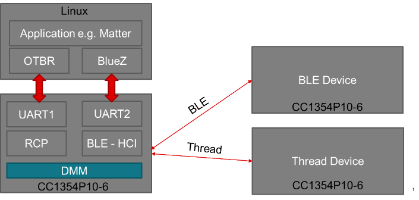

# OpenThread RCP-BLE-Controller Example

# Introduction

This document describes how to communicate with both Thread and BLE devices using a single TI CC2755P20 (or compatible cc27xx device) attached to a Linux machine over **a single USB serial port**.

This is accomplished by the TI device running the DMM (RCP + BLE-Controller) example with the **Combined Serial MUX**, which multiplexes Thread spinel and BLE HCI traffic over one UART using HDLC framing and Spinel NLI routing.

The Linux host runs:
- `host_mux_ot_ble` — a daemon that demultiplexes the single serial stream into two PTY devices
- `otbr-agent` — connects to the Thread PTY to provide a Thread Border Router
- `hciattach` / BlueZ — connects to the BLE PTY for Bluetooth LE functionality

<div style="text-align: center;">
  
  <div class="caption">Figure 1. Example RCP-BLE-Controller Setup</div>
</div>

# Software Prerequisites

- [Border Router software](https://github.com/openthread/ot-br-posix)
- [UniFlash](https://www.ti.com/tool/UNIFLASH)
- x86 based Linux environment for application builds and host daemon
- GCC for building `host_mux_ot_ble`

# Hardware Prerequisites

- **One** USB cable connecting the LaunchPad XDS110 port to the Linux host
  (no FTDI cable required — single UART carries both Thread and BLE)
- TI LaunchPad with XDS110 onboard debugger/UART
- [SimpleLink LP_EM_CC2755P20 Launchpad](https://www.ti.com/tool/LP-EM-CC2755P20)
- Raspberry Pi or x86 Linux host running Ubuntu 22.04+

# Wire Protocol

The Combined Serial MUX encapsulates each protocol in an HDLC frame with a Spinel header:

```
[0x7E] [Spinel header (NLI)] [payload] [CRC16] [0x7E]

NLI 0 = Thread spinel frames  → otbr-agent
NLI 1 = BLE HCI packets       → BlueZ / hciattach
NLI 3 = Keepalive heartbeat   → internal
```

# Building the Example

```bash
cd ot-ti
./script/bootstrap          # first time only

./script/build LP_EM_CC2755P20 -DOT_APP_RCP_BLE_CONTROLLER=1
```

Flash `build/bin/ot-rcp-ble-controller.out` using UniFlash.

# Example Usage

## 0. Identify the Serial Port

Plug in the LaunchPad via its XDS110 USB cable. Identify the port:

```bash
ls /dev/ttyACM*
# Typically /dev/ttyACM0 (application UART) and /dev/ttyACM1 (XDS110 debug)
```

The **application UART** (usually the lower-numbered port, e.g. `/dev/ttyACM0`)
carries both Thread spinel and BLE HCI traffic over the Combined Serial MUX.

## 1. Build and Start the Host Daemon

```bash
cd examples/apps/dmm/rcp_ble_controller/host

# Set SDK path (adjust to your installation)
export TI_SIMPLELINK_SDK_DIR=/path/to/simplelink_lowpower_f3_sdk

make
./host_mux_ot_ble --device /dev/ttyACM0 --baud 921600
```

On startup the daemon prints the two slave PTY paths:

```
OT PTY:  /dev/pts/2
BLE PTY: /dev/pts/3
```

Keep this terminal open. The daemon must remain running while using Thread or BLE.

## 2. Set Up Linux Host (OTBR)

Follow Task 1 of the [Border router set up guide](https://openthread.io/guides/border-router/build)
to install OTBR on your Linux machine.

Start OTBR using the **OT PTY** path printed by `host_mux_ot_ble`:

```bash
sudo otbr-agent -I wpan0 spinel+hdlc+uart:///dev/pts/2?uart-baudrate=921600
```

## 3. Start RCP (Thread Network)

Open a separate terminal and configure the Thread network:

```bash
sudo ot-ctl dataset init new
sudo ot-ctl dataset panid 0xface
sudo ot-ctl dataset channel 11
sudo ot-ctl dataset networkkey 00112233445566778899aabbccddeeff
sudo ot-ctl dataset commit active
sudo ot-ctl ifconfig up
sudo ot-ctl thread start
```

Check status after a few seconds:

```bash
sudo ot-ctl state
leader
Done
```

## 4. Start Thread Node 1

Build a CLI FTD image for a second board and join the network:

```bash
> networkkey 00112233445566778899aabbccddeeff
> panid 0xface
> channel 11
> ifconfig up
> thread start
```

After a few seconds:

```bash
> state
child
Done
```

## 5. Ping Node 1 from RCP

```bash
> ipaddr rloc
fd9e:6062:a089:68d:0:ff:fe00:4800
Done

sudo ot-ctl ping fd9e:6062:a089:68d:0:ff:fe00:4800
18 bytes from fd9e:6062:a089:68d:0:ff:fe00:4800: icmp_seq=1 hlim=64 time=24ms
```

## 6. Configure BLE on the Linux Host

Attach BlueZ to the **BLE PTY** path printed by `host_mux_ot_ble`:

```bash
sudo hciattach /dev/pts/3 any 921600
```

Verify the adapter is up:

```bash
sudo hciconfig
hci0:   Type: Primary  Bus: UART
        BD Address: XX:XX:XX:XX:XX:XX  ACL MTU: 255:5  SCO MTU: 0:0
        UP RUNNING
```

## 7. Scan for BLE Devices

```bash
bluetoothctl
> select XX:XX:XX:XX:XX:XX
> scan le
```

## 8. Connect to a BLE Device

```bash
bluetoothctl
> connect XX:XX:XX:XX:XX:XX
```

# Notes

- Both Thread and BLE use baud rate **921600**.
- The `host_mux_ot_ble` daemon sends a keepalive every 5 seconds and exits
  after 3 consecutive missed keepalives (15 seconds of device silence).
- The daemon exits with code 2 on watchdog expiry and 0 on clean shutdown
  (SIGTERM / SIGINT). A wrapper script can restart it automatically.
